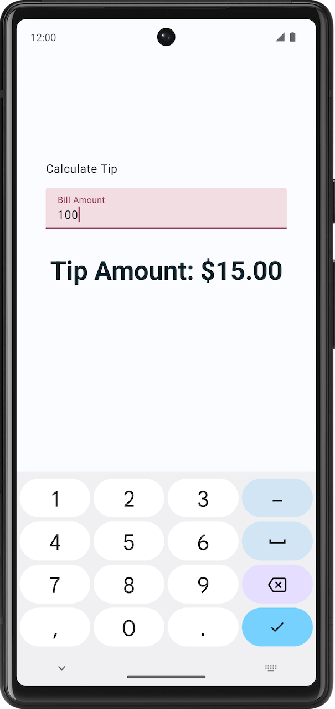

# Tip Time - Calculadora de Propinas 📱💸

Una aplicación moderna para dispositivos Android que calcula de manera automática la propina basada en el total del consumo. Este proyecto fue desarrollado con fines educativos como parte del curso **Android Basics with Compose** de Google.

---

## 📸 Vista Previa

A continuación se muestra una captura de pantalla de la aplicación en funcionamiento:

<p align="center">
  
</p>

---

## 🚀 Características

- **Cálculo en Tiempo Real:** Calcula instantáneamente el monto de la propina a medida que se ingresa el total de la cuenta.
- **Formato de Moneda Local:** Aplica formato de moneda automáticamente según la configuración regional del dispositivo (ej. $, €, etc.).
- **Diseño Adaptable (Edge-to-Edge):** Interfaz fluida que se extiende por toda la pantalla aprovechando las barras de estado y navegación.
- **Desarrollado con Jetpack Compose:** Uso de componentes declarativos modernos y manejo de estado reactivo (`remember` y `mutableStateOf`).

---

## 🛠️ Tecnologías y Herramientas

- **Lenguaje:** [Kotlin](https://kotlinlang.org/)
- **Framework de UI:** [Jetpack Compose](https://developer.android.com/compose)
- **Diseño:** [Material Design 3](https://m3.material.io/)
- **Entorno de Desarrollo:** [Android Studio](https://developer.android.com/studio)

---

## ⚙️ Requisitos Previos e Instalación

Para ejecutar este proyecto de forma local, asegúrate de tener:

1. **Android Studio** (versión Ladybug o superior recomendada).
2. **SDK de Android** instalado con soporte para nivel de API 34 o superior.
3. Un dispositivo físico Android con la depuración USB activada o un emulador configurado.

### Pasos para ejecutar:

1. Clona este repositorio en tu máquina local:
   ```bash
   git clone <URL_DEL_REPOSITORIO>
   ```
2. Abre Android Studio.
3. Selecciona **File > Open** y elige la carpeta del proyecto.
4. Espera a que termine la sincronización de Gradle.
5. Haz clic en el botón **Run** (ícono de reproducir verde) para instalar y ejecutar la app en tu dispositivo o emulador.
